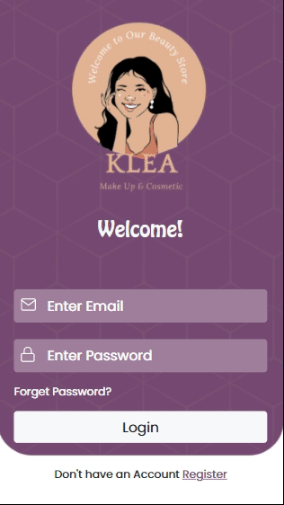

# KLEA Make Up and Cosmetic

This project aims to make a design into reality :rainbow:. I found the design on the [dribble](https://dribbble.com/). I got in contact with some designers. Thanks **[Basit Shaikh](https://dribbble.com/Basit_shaikh)** to permitted me to use his **[Klea makeup and cosmetic](https://dribbble.com/shots/16931133-KLEA-Make-Up-Cosmetic)** design. 

It has taken 5 days to make the design reality. I worked approximately 4 hours each day :woman_technologist: :hourglass_flowing_sand:

You can reach my project **[DEMO](https://mervekrblt.github.io/klea-makeup-and-cosmetic/)**:lipstick: :nail_care:

## Technologies that I used
- Bootstrap 5
- SCSS
- HTML
- ADOBE XD

## Previews
- Mobile



- Desktop


## How to install

```bash
git clone https://github.com/mervekrblt/klea-makeup-and-cosmetic.git
npm install
```